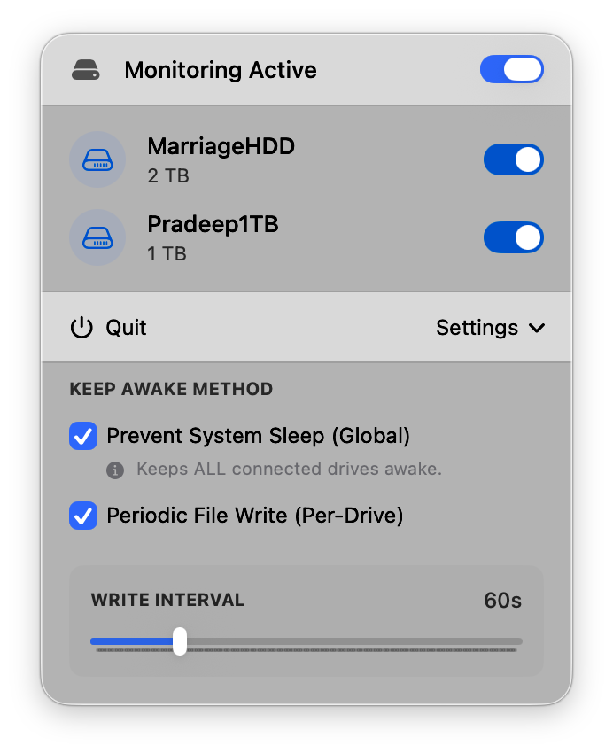

# KeepDiskAlive


**Prevent your external drives from sleeping on macOS.**



A modern, native macOS menu bar application designed to keep your external drives awake using configurable strategies. Built with SwiftUI for a seamless and lightweight experience.

## ✨ Features

### 🚀 Flexible Strategies
- **Periodic File Write**: Writes a tiny hidden file (`.keepdiskalive.txt`) to the drive every 60 seconds. Safe, reliable, and works per-drive.
- **System Sleep Prevention**: Uses `pmset` to globally prevent disk sleep (affects all drives).

### 🛡️ Smart & Safe
- **Auto-Cleanup**: Automatically cleans up temporary files and reverts system settings when you quit or disable the app.
- **Safety First**: Filters out internal system drives (like Macintosh HD) to prevent accidental modifications.
- **Permission Aware**: Requests admin privileges only when necessary (for `pmset`) via secure system prompts.

### 💎 Modern Experience
- **Native UI**: Clean, menu-bar centric design built with SwiftUI.
- **Persistence**: Remembers your settings, active strategies, and per-drive toggles across restarts.
- **Visual Feedback**: Clear status indicators for active monitoring.

---

## 📦 Installation

### ⚡ Quick Install (Recommended)
Download the pre-built app and start using it immediately:

1. **Download the latest release**
   - Go to the [Releases](https://github.com/nginxdev/keep-disk-alive-mac/releases) page.
   - Download `KeepDiskAlive.zip` from the latest release.

2. **Install the app**
   - Unzip the downloaded file.
   - Drag `KeepDiskAlive.app` to your **Applications** folder.

3. **First launch**
   - Open your Applications folder.
   - **Right-click** on `KeepDiskAlive.app` and select **Open**.
   - Click **Open** in the security dialog (required for first launch only to bypass Gatekeeper).

> **Note**: This app is not notarized yet. You must use the Right-Click -> Open method on the first run.

### 🔨 Build from Source

Process to build the app locally:

```bash
# Clone the repository
git clone https://github.com/nginxdev/keep-disk-alive-mac.git
cd keep-disk-alive-mac

# Build the release version
./build_app.sh

# The app bundle will be created in the current directory as KeepDiskAlive.app
open KeepDiskAlive.app
```

---

## 🎯 How to Use

### 1️⃣ Choose Your Strategy
Open the settings panel (gear icon) to select how you want to keep drives awake:
- **Periodic File Write**: recommended for most users. Keeps specific drives awake by writing a tiny file.
- **Prevent System Sleep**: forceful global switch using system commands.

### 2️⃣ Global Control
Use the master toggle at the top of the menu to instantly **Pause** or **Resume** monitoring for all drives.

### 3️⃣ Per-Drive Control
The list displays all connected external drives.
- **Toggle ON**: Keep this specific drive awake (uses File Write strategy).
- **Toggle OFF**: Let this drive sleep naturally.

---

## 🛠️ System Requirements
- macOS Ventura (13.0) or later
- Apple Silicon or Intel Mac

---

## 🤝 Contributing
Contributions are welcome! Please feel free to submit a Pull Request.

## 📝 License
This project is licensed under the MIT License - see the LICENSE file for details.

---
Built with ❤️ in Berlin.
